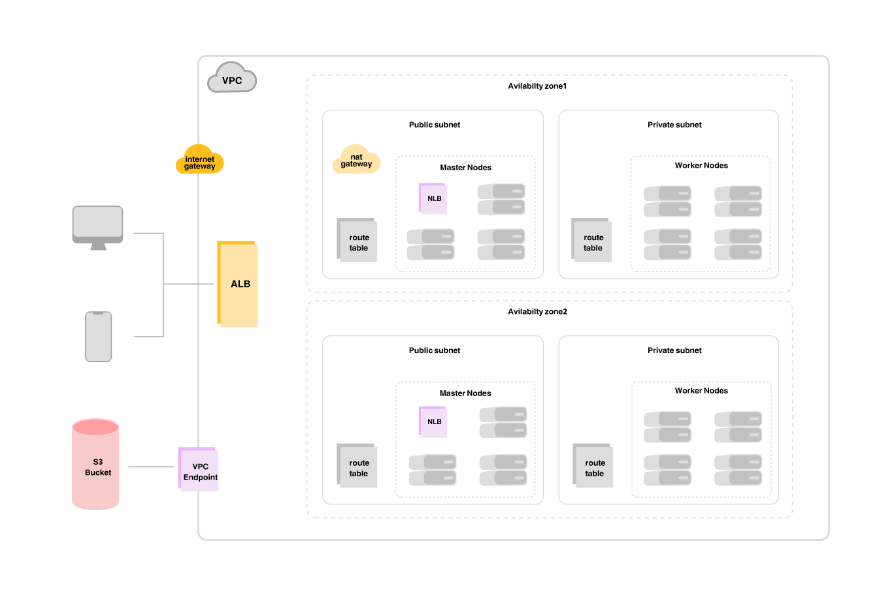

# Kubernetes Cluster Infrastructure using Terraform

This repository contains Terraform scripts to set up a highly available Kubernetes cluster with master and worker nodes. The cluster is configured with a network load balancer (NLB) for internal communication between Kubernetes components and an application load balancer (ALB) for external services using NGINX Ingress. The cluster also utilizes AWS resources, such as EC2 instances, VPC, security groups, and load balancers, along with SSH access configuration and Ansible provisioning for post-deployment tasks.



## Table of Contents

- [Overview](#overview)
- [Prerequisites](#prerequisites)
- [Configuration](#configuration)
- [Architecture](#architecture)
- [Usage](#usage)
- [Load Balancers](#load-balancers)
- [Ansible Provisioning](#ansible-provisioning)
- [SSH Keys Management](#ssh-keys-management)
- [Future Improvements](#future-improvements)

## Overview

This infrastructure deploys the following components:

1. A Virtual Private Cloud (VPC) with private and public subnets.
2. Kubernetes master and worker nodes using AWS EC2 instances.
3. A Network Load Balancer (NLB) for master and worker node traffic.
4. An Application Load Balancer (ALB) for external traffic routed via the NGINX Ingress controller.
5. Automated provisioning of Kubernetes resources using Ansible.
6. Secure SSH access to the cluster for further configuration.

The Terraform scripts also handle the generation of an SSH private key, which is stored locally and used to interact with the EC2 instances.

## Prerequisites

- AWS Account with appropriate permissions for EC2, VPC, and other resources.
- Terraform installed on your local machine.
- SSH access with an existing key pair (optional, or Terraform can generate one).
- Ansible installed on your local machine for configuration management.
- IAM roles and permissions set up in AWS for provisioning EC2 and load balancer resources.

## Configuration

The configuration uses the following structure for deploying the Kubernetes cluster and associated resources:

- **EC2 Instances**: Both master and worker nodes are provisioned in private subnets. The instances are set up with the necessary security groups and IAM roles for accessing other AWS resources.
- **SSH Access**: Terraform generates an RSA 4096-bit SSH key pair that is used for provisioning the EC2 instances. The private key is stored locally as `k8_ssh_key.pem`.
- **VPC Setup**: The VPC is provisioned with public and private subnets to isolate the master and worker nodes.
- **Ansible Inventory**: Terraform generates an inventory file (`inventory`) with the private IP addresses of the master and worker nodes, which is used by Ansible for further provisioning.

### SSH Key Management

- The TLS provider is used to generate an RSA SSH key pair.
- The public key is uploaded to AWS as an EC2 key pair.
- The private key is stored locally and used to SSH into the bastion host and the cluster nodes for provisioning.

```hcl
resource "tls_private_key" "ssh" {
  algorithm = "RSA"
  rsa_bits  = 4096
}

resource "local_file" "k8_ssh_key" {
  filename = "k8_ssh_key.pem"
  file_permission = "600"
  content  = tls_private_key.ssh.private_key_pem
}

resource "aws_key_pair" "k8_ssh" {
  key_name   = "k8_ssh"
  public_key = tls_private_key.ssh.public_key_openssh
}
```

## Architecture

- **Bastion Host**: A bastion host is provisioned in the public subnet to allow secure SSH access to the master and worker nodes in private subnets.
- **Network Load Balancer (NLB)**: Used to distribute traffic among the Kubernetes master nodes on port 6443 (Kubernetes API).
- **Application Load Balancer (ALB)**: Handles external traffic routed to the worker nodes via NGINX Ingress.

## Usage

### Step-by-Step Setup

1. **Initialize Terraform**:

   ```bash
   terraform init
   ```
2. **Plan the Infrastructure**:

   ```bash
   terraform plan
   ```
3. **Apply the Infrastructure**:

   ```bash
   terraform apply
   ```
4. **Access the Cluster**: Use the generated `k8_ssh_key.pem` to SSH into the bastion host.

   ```bash
   ssh -i k8_ssh_key.pem ubuntu@<bastion-public-ip>
   ```
5. **Run Ansible Playbooks**: After the infrastructure is provisioned, the Ansible playbooks are copied to the bastion host and executed to configure Kubernetes.

   ```bash
   ansible-playbook -i /home/ubuntu/inventory /home/ubuntu/ansible/play.yml
   ```

### Load Balancers

- **Master Node NLB**: The NLB is used for distributing traffic across the Kubernetes master nodes. It operates on port 6443 for the Kubernetes API.

```hcl
resource "aws_lb" "k8_masters_lb" {
    name = "k8-masters-lb"
    internal = true
    load_balancer_type = "network"
    subnets = module.vpc.private_subnets
}

resource "aws_lb_target_group" "k8_masters_api" {
    name = "k8-masters-api"
    port = 6443
    protocol = "TCP"
    vpc_id = module.vpc.vpc_id
    target_type = "ip"
    health_check {
      port = 6443
      protocol = "TCP"
    }
}
```

- **Worker Node NLB & ALB**: The NLB routes traffic to the worker nodes for internal communication, while the ALB manages external traffic.

### Ansible Provisioning

Terraform automatically creates an Ansible inventory file containing the IP addresses of the Kubernetes master and worker nodes. The following null resources handle the provisioning:

```hcl
resource "null_resource" "run_ansible" {
  provisioner "remote-exec" {
    inline = [
      "ansible-playbook -i /home/ubuntu/inventory /home/ubuntu/ansible/play.yml"
    ]
  }
}
```

This step ensures that Kubernetes is correctly installed and configured on the EC2 instances.

## SSH Keys Management

The SSH key pair is generated locally by Terraform and used for both:

- Uploading the Ansible playbooks to the bastion host.
- SSH-ing into the bastion and other EC2 instances for post-deployment tasks.

## Future Improvements

- **Signaling-Based Wait**: Replace the `time_sleep` resource for waiting on the bastion host's initialization with a more robust signaling mechanism using AWS Systems Manager (SSM).

```hcl
resource "time_sleep" "wait_for_bastion_init" {
  create_duration = "120s"
}
```

- **ALB HTTPS Support**: Add an ACM certificate and configure the Application Load Balancer (ALB) for HTTPS traffic.

```hcl
# resource "aws_acm_certificate" "acm_cert" {
#   domain_name = "yourdomain.com"
#   validation_method = "DNS"
# }
```

## Conclusion

This Terraform project simplifies the setup of a production-ready Kubernetes cluster in AWS, with security, scalability, and high availability in mind. By using best practices such as isolated subnets, load balancing, and Ansible automation, the infrastructure is designed to be both flexible and robust for modern cloud-native applications.
